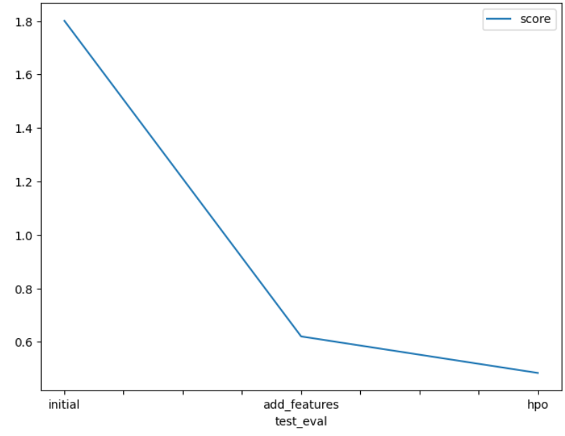

# Report: Predict Bike Sharing Demand with AutoGluon Solution
### Carlos Rendon

## Initial Training
### What did you realize when you tried to submit your predictions? What changes were needed to the output of the predictor to submit your results?
I realized that kaggle rejects submissions with negative predictions so to handle this, I set all negative values equal to 0.

### What was the top ranked model that performed?
My top ranked model was WeightedEnsemble_L3 after tuning the hyperparameters, getting a kaggle score of 0.48359.

## Exploratory data analysis and feature creation
### What did the exploratory analysis find and how did you add additional features?
For EDA, I took the datetime feature and split it into month, day, and hour features to investigate trends on bike demand over different scales of time. After creating histograms of all the features, I could see that bike demand varied greatly by months and even hour to hour. 

### How much better did your model preform after adding additional features and why do you think that is?
After adding the month, day, and hour features, the kaggle score improved significantly from 1.80062 to 0.62019, and the model validation score went from 53.40 to 30.4. These are RMSE scores, so the closer to 0, the better the performance. I believe the addition of these features made the model much better because instead of looking at single dates, the model could now draw patterns between different time periods, like months, days, and hours, providing better predictions.

## Hyper parameter tuning
### How much better did your model preform after trying different hyper parameters?
After trying different hyperparameters for GBM, CAT, and XGB, the kaggle score went from 0.62019 to 0.48359, showing some improvement. On the other hand, the model score worsened slightly going from 30.40 to 35.63. Overall, by varying the number of trees to build and the learning rate, some improvement was seen.

### If you were given more time with this dataset, where do you think you would spend more time?
If I was given more time, first I'd figure out a way to circumvent the hardware limitations because the training time was cut down due to memory limits from 600 to 150 seconds. I'd also experiment with additional features, such as seasons and weekends to further inform bike share trends. I could also spend more time investigating different models and how to optimize the hyperparameters to produce the best scores possible.

### Create a table with the models you ran, the hyperparameters modified, and the kaggle score.
|model|hpo1|hpo2|hpo3|score|
|--|--|--|--|--|
|initial|None|None|None|1.80062|
|add_features|None|None|None|0.62019|
|hpo|learning_rate= 0.05|n_estimators=100|num_boost_round=100|0.48359|

### Create a line plot showing the top model score for the three (or more) training runs during the project.

TODO: Replace the image below with your own.

### Create a line plot showing the top kaggle score for the three (or more) prediction submissions during the project.

TODO: Replace the image below with your own.

## Summary
This project predicts bike rental demand using machine learning models on the Kaggle Bike Sharing Demand dataset. It leverages AutoGluon to train and tune several models (LightGBM, CatBoost, and XGBoost), optimizing their hyperparameters to minimize prediction error and improve forecast accuracy.
